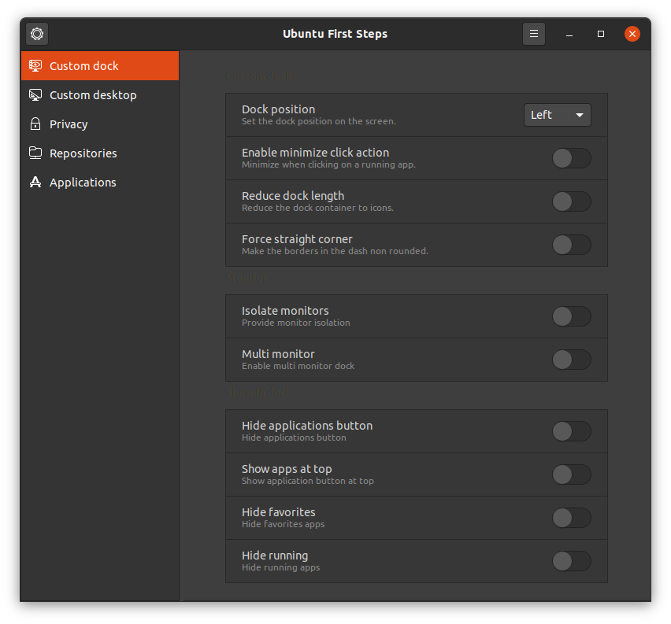
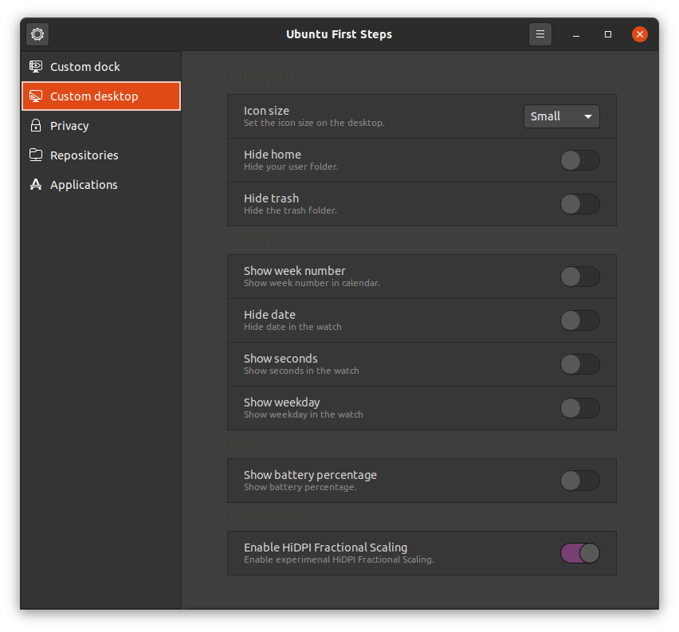
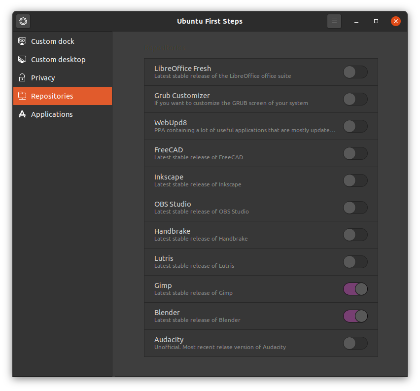
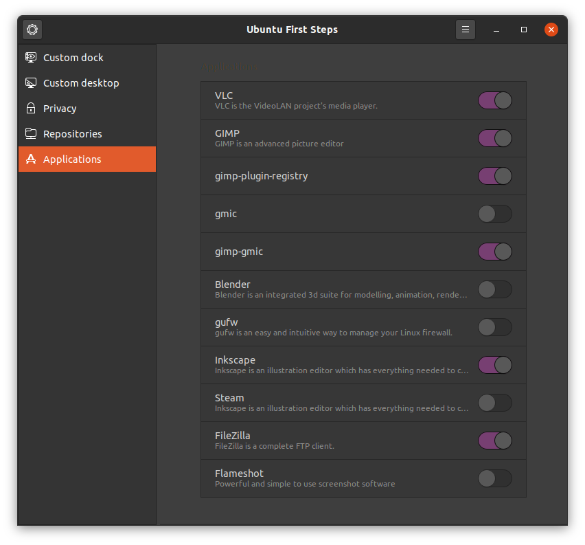
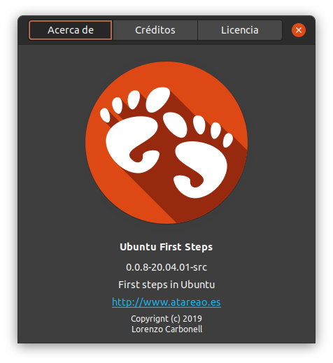

<h1 align="center">Welcome to Ubuntu First Steps 👋<h1>


[](https://www.codacy.com/manual/atareao/ubuntu-first-steps?utm_source=github.com&amp;utm_medium=referral&amp;utm_content=atareao/ubuntu-first-steps&amp;utm_campaign=Badge_Grade)
[](https://www.codefactor.io/repository/github/atareao/ubuntu-first-steps/overview/master)

[](https://twitter.com/atareao)


## 🏠 [Homepage](https://www.atareao.es/aplicacion/ubuntu-first-steps/)

## Prerequisites

Before you begin, ensure you have met the following requirements:

* If you install it from PPA don't worry about, because all the requirements are included in the package
* If you clone the repository, you need, at least, these dependencies,

```
python3-gi
gir1.2-gtk-3.0
gir1.2-gdkpixbuf-2.0
gir1.2-glib-2.0
gir1.2-vte-2.91
gir1.2-handy-0.0
```

## Installing Ubuntu First Steps

To install **Ubuntu First Steps**, follow these steps:

* In a terminal (`Ctrl+Alt+T`), run these commands

```
sudo add-apt-repository ppa:atareao/atareao
sudo apt update
sudo apt install ubuntu-first-steps
```

## Using Ubuntu First Steps

**Ubuntu First Steps** has 5 main sections to custom the Ubuntu User Experience

* Custom dock



* Custom desktop



* Privacy


* Repositories



* Applications



### About this application



## Contributing to Ubuntu First Steps

To contribute to **Ubuntu First Steps**, follow these steps:

1. Fork this repository.
2. Create a branch: `git checkout -b <branch_name>`.
3. Make your changes and commit them: `git commit -m '<commit_message>'`
4. Push to the original branch: `git push origin <project_name>/<location>`
5. Create the pull request.

Alternatively see the GitHub documentation on [creating a pull request](https://help.github.com/en/github/collaborating-with-issues-and-pull-requests/creating-a-pull-request).

## 👤 Contributors ✨

Thanks goes to these wonderful people ([emoji key](https://allcontributors.org/docs/en/emoji-key)):

<table>
  <tr>
    <td align="center"><a href="https://www.atareao.es"><br /><sub><b>Lorenzo Carbonell</b></sub></a><br /><a href="https://github.com/atareao/fondos-productivos/commits?author=atareao" title="Code">💻</a></td>
  </tr>
</table>


## Contact

If you want to contact me you can reach me at [atareao.es](https://www.atareao.es).

## License

This project uses the following license: [MIT License](https://choosealicense.com/licenses/mit/).
